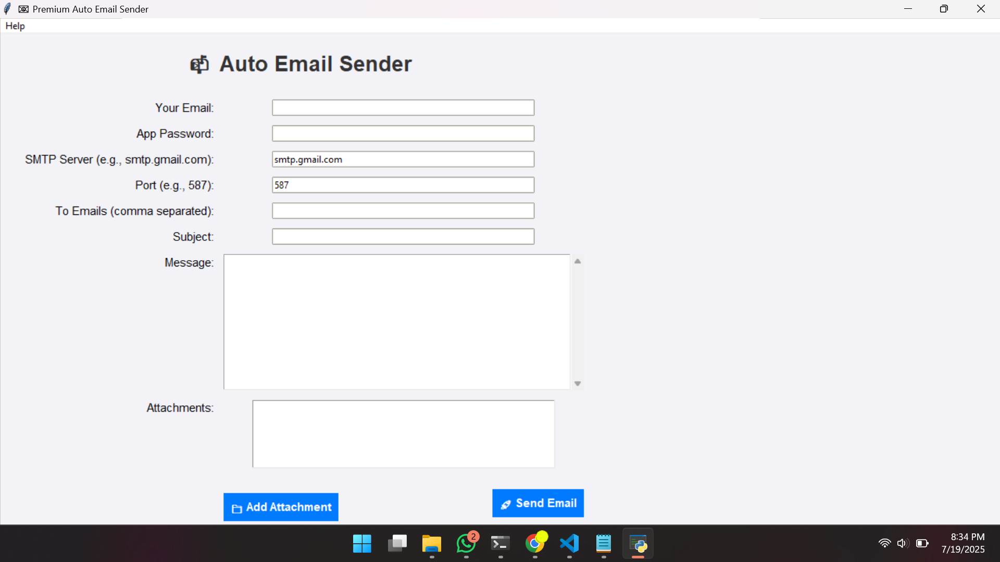

# 📧 Premium Auto Email Sender

A modern, professional email-sending desktop application built with Python’s Tkinter GUI toolkit. Designed with a clean macOS-style interface, it supports drag-and-drop file attachments, multi-recipient delivery, secure SMTP authentication, and real-time logging.

---

## 🛠️ Features

- ✅ **Responsive & Native-like UI** (macOS feel)
- 📝 **Multi-recipient support** (comma-separated)
- 📎 **Drag & drop attachments**
- 🔐 **App Password Authentication** (Gmail, Outlook, Yahoo)
- 📤 **SMTP configuration flexibility**
- 📁 **File size display for attachments**
- 📜 **Rich message editor with scroll**
- 🔄 **Threaded sending** to avoid GUI freezing
- 📃 **Logging** of sent emails and errors

---

## 📸 Screenshots



---

## 🧑‍💻 Technologies Used

- Python 3.x
- Tkinter (GUI Framework)
- `tkinterdnd2` (Drag & Drop support)
- `smtplib` & `email.message` (for sending emails)
- `threading` (to keep UI responsive)
- `logging` (for error tracking and activity logs)

---

## 🚀 Getting Started

### 1. Clone the Repository

```bash
git clone https://github.com/ShiboshreeRoy/Auto-Email-Sender.git
```
### 2. Copy
```bash
cd Auto-Email-Sender
```

### Download Software for Windows 10/11

[Download](./dist/AutoMailSender.exe)

